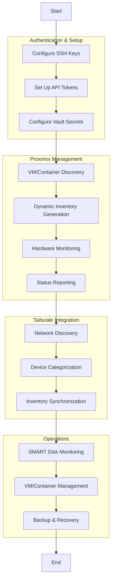

# PhalanxEdge Core - ProxMesh Manager

# CURRENTLY A MANJOR WIP

**PhalanxEdge Core - ProxMesh Manager** is---ehensive automation suite designed for edge computing infrastructure with Proxmox virtualization environments and secure remote access via Tailscale mesh networking. It provides robust tooling for Proxmox infrastructure deployment, management, monitoring, and integration with mesh networking for distributed edge computing scenarios.

---

## What is PhalanxEdge Core?

PhalanxEdge Core is an advanced Ansible-based framework for managing edge computing infrastructure. The ProxMesh Manager component bridges Proxmox virtualization with Tailscale mesh networks to create a unified, secure edge computing platform. It enables secure authentication, dynamic inventory management, VM discovery, SMART monitoring, and comprehensive automation for Proxmox clusters. The framework automates key administrative tasks while providing audit trails and secure credential management through Ansible Vault.

---

## PhalanxEdge Automation Workflow 

> **Visual Overview:**  
> The following flowchart illustrates the core automation workflow of the PhalanxEdge ProxMesh Manager.



---

## PhalanxEdge Core Features

### 🔍 PhalanxEdge Proxmox Infrastructure Management

- **API Integration:** Seamless connection to Proxmox API with token-based authentication
- **VM Discovery:** Automatic discovery and inventory of virtual machines and containers
- **Cluster Management:** Multi-node cluster support with tailored inventory for each node
- **Hardware Monitoring:** SMART disk monitoring with reporting and alerting capabilities
- **Command-Line Interface:** Unified management through the `proxmox-manager.sh` script
- **Secure Vault Management:** Credential storage and retrieval through encrypted vaults

### 🗂️ PhalanxEdge Inventory Management

- **Edge-Aware Discovery:** Automatically discovers edge computing resources across your network
- **Multi-Format Support:** Generates and maintains inventories in both YAML and INI formats
- **Backup & Validation:** Automatic inventory backup and validation before deployment
- **Cross-Environment Integration:** Links Proxmox and Tailscale inventories for unified management
- **Customizable Grouping:** Categorizes resources by status, type, node, and custom tags

### 🔒 Security & Authentication

- **Vault Integration:** Secure credential storage using Ansible Vault
- **SSH Key Management:** Automated deployment and rotation of SSH keys
- **Token-Based Authentication:** API token management for secure, non-password access
- **Audit Logging:** Comprehensive logging of all administrative operations
- **Secure File Permissions:** Proper permission management for sensitive configuration files

### ⚡ Edge Monitoring & Reporting

- **SMART Monitoring:** Comprehensive disk health monitoring across Proxmox nodes via `proxmox-smart-report.yml`
- **CSV Reporting:** Generates reports with disk health metrics and operational data
- **Status Tracking:** Real-time status monitoring of virtual machines and containers with Proxmox API integration
- **Hardware Inventory:** Complete hardware inventory of physical and virtual resources
- **Network Status:** Tailscale mesh network monitoring and ansible inventory managment via `tailscale-status.yml`
- **Integration Ready:** Designed for extension with external monitoring systems like Prometheus

---

## Security Practices

- **Zero Trust Networking:** Utilizes Tailscale’s WireGuard-based mesh for encrypted, authenticated device communication.
- **Principle of Least Privilege:** All operations are performed with minimal required permissions.
- **Audit Trails:** All critical actions are logged for compliance and forensics.
- **Inventory Validation:** Prevents deployment with broken or malformed inventories.

---

## PhalanxEdge Use Cases

- **Edge Device Management:** Securely manage fleets of remote devices, IoT, and edge compute nodes within the PhalanxEdge ecosystem.
- **Distributed Infrastructure:** Deploy and manage computing resources at the network edge for reduced latency and improved performance.
- **Automation:** Maintain dynamic inventories for CI/CD, blue/green deployments, and zero-downtime updates.
- **Home Lab & Personal Cloud:** Gain visibility and control over all your devices, from laptops to Raspberry Pis.
- **Incident Response:** Rapidly detect and respond to device state changes or unauthorized network activity across your edge deployment.

---

## PhalanxEdge Future Directions

- **Edge AI Integration:** On-device machine learning and AI capabilities for intelligent edge processing.
- **Cloud Provider Integration:** AWS, Azure, GCP inventory and secrets management for hybrid edge-cloud deployments.
- **Automated Compliance Checks:** CIS benchmarks, vulnerability scanning, and remediation.
- **Self-Service Portal:** Web UI for inventory visualization and edge device management.
- **Advanced Alerting:** Integration with messaging and monitoring platforms.
- **Policy Enforcement:** Automated firewall, patching, and configuration drift correction across the edge fleet.
- **Edge-to-Cloud Data Pipeline:** Seamless data flow between edge devices and cloud resources.

---

## Getting Started with PhalanxEdge

1. **Clone the repository** and review the `requirements.yml` for dependencies.
2. **Configure your Tailscale network** and ensure all edge devices are connected.
3. **Set up your Proxmox environment** using the bootstrap playbooks:
   ```bash
   ansible-playbook playbooks/bootstrap-host.yml
   ```
4. **Configure Proxmox API access** by setting up API tokens:
   ```bash
   ./scripts/create_proxmox_api_token.sh
   ```
5. **Run the key setup script** to establish secure SSH access:
   ```bash
   ./scripts/setup_ssh_keys.sh
   ```
6. **Generate your Proxmox inventory**:
   ```bash
   ./scripts/update_proxmox_inventory.sh
   ```
7. **Run the Proxmox manager** to access core functionality:
   ```bash
   ./scripts/proxmox-manager.sh
   ```
8. **Review generated inventories** in the `inventory/` directory.
9. **Deploy edge applications** using the provided templates and roles.

---

## PhalanxEdge Project Organization

The repository is structured for maximum flexibility and clear separation of concerns:

```
.
├── ansible.cfg             # Core Ansible configuration with plugin settings
├── backups/                # Automated backup storage for configurations
├── inventory/              # Dynamic and static inventory files
│   ├── proxmox.yml         # Proxmox dynamic inventory configuration
│   └── tailscale.yml       # Tailscale mesh inventory configuration
├── playbooks/              # Core automation playbooks
│   ├── bootstrap-host.yml  # Initial host setup automation
│   ├── proxmox_info.yml    # Proxmox information gathering
│   └── tailscale-status.yml # Tailscale network status reporting
├── roles/                  # Reusable automation roles
│   ├── proxmox-auth/       # Authentication management for Proxmox
│   ├── proxmox-checks/     # Monitoring and health check implementations
│   └── proxmox-images/     # VM template and image management
├── scripts/                # Management and utility scripts
│   ├── proxmox-manager.sh  # Main CLI management interface
│   └── setup_ssh_keys.sh   # SSH key deployment automation
└── vars/                   # Variable storage for playbooks and roles
```

### Key Components

- **Dynamic Inventory:** Auto-discovery of infrastructure resources using custom inventory plugins
- **Security Automation:** Scripts and roles for managing secure access across the infrastructure
- **Proxmox Manager:** Central CLI management tool for common administrative tasks
- **Health Monitoring:** Automated checks and reporting for system health across the edge
- **Tailscale Integration:** Mesh network discovery and secure access management

---

## About PhalanxEdge

PhalanxEdge - Core is developed and maintained with a focus on secure, scalable, and user-friendly automation for the modern edge computing environment. The ProxMesh Manager component extends these capabilities specifically for Proxmox-based infrastructure with Tailscale mesh networking.

PhalanxEdge combines the power of:
- **Proxmox VE** for robust virtualization and containerization
- **Ansible** for infrastructure as code and automation
- **Tailscale** for secure, zero-config mesh networking
- **Vault** for secure credential management

This integration creates a comprehensive platform suitable for individuals, teams, and organizations looking to deploy, manage, and secure distributed edge computing infrastructure from personal labs to enterprise environments.

---

*For more information, demos, or to discuss deployments, please contact the project maintainer.*

## Quick Command Reference

```bash
# Setup and bootstrap a new Proxmox host
./scripts/proxmox-manager.sh --bootstrap

# Generate updated inventory from Proxmox API
./scripts/proxmox-manager.sh --update-inventory

# Run SMART disk health checks
./scripts/proxmox-manager.sh --smart-check

# Check Tailscale network status
ansible-playbook playbooks/tailscale-status.yml

# Deploy SSH keys to hosts
./scripts/setup_ssh_keys.sh

# Secure API token management
./scripts/create_proxmox_api_token.sh
```

---

*Last updated: May 18, 2025*
