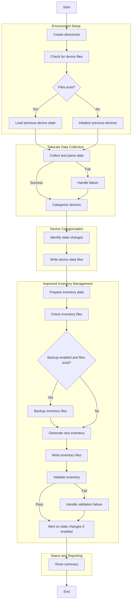

# PhalanxEdge - Core

**PhalanxEdge - Core** is a comprehensive automation and network management toolkit designed for modern, distributed, and privacy-focused infrastructure. It leverages open-source technologies like Ansible and Tailscale to provide seamless device discovery, dynamic inventory management, and robust security practices for edge, cloud, and hybrid environments.

---

## What is PhalanxEdge - Core?

PhalanxEdge - Core is the foundational layer of the PhalanxEdge ecosystem. It automates the discovery and management of devices across a Tailscale mesh network, maintaining up-to-date inventories and enabling secure, auditable operations. The project is ideal for anyone seeking to simplify infrastructure management, improve visibility, and enforce strong security standards across diverse environments.

---

## Playbook Flowchart

> **Visual Overview:**  
> The following flowchart illustrates the main logic and flow of the PhalanxEdge - Core playbook.

---

## Features

### 🔍 Automated Network Discovery

- Scans the Tailscale network to identify all connected devices.
- Categorizes devices as active, offline, or exit nodes.
- Groups devices by operating system (Linux, Windows, macOS, iOS, Android, FreeBSD, and more).

### 🗂️ Dynamic Inventory Management

- Generates and maintains real-time Ansible inventories in both YAML and INI formats.
- Backs up and validates inventories to prevent configuration drift or corruption.
- Supports easy integration with additional playbooks and roles.

### 🔒 Security & Compliance

- **Audit Logging:** Every inventory update is logged with user, host, and timestamp.
- **File Permissions:** Sensitive files are written with restrictive permissions.
- **Backup & Recovery:** Automatic backup of inventories before every change.
- **Validation:** Inventories are validated before being used, with automatic rollback on failure.

### ⚡ Extensible & Modular

- Modular directory structure for scalable deployments.
- Designed for future integration with cloud APIs, monitoring, and alerting systems.
- Easily adaptable for new device types and environments.

### 📈 Reporting & Alerting

- Summarizes device state changes (new, removed, online/offline transitions).
- Optional alerting for rapid incident response.

---

## Security Practices

- **Zero Trust Networking:** Utilizes Tailscale’s WireGuard-based mesh for encrypted, authenticated device communication.
- **Principle of Least Privilege:** All operations are performed with minimal required permissions.
- **Audit Trails:** All critical actions are logged for compliance and forensics.
- **Inventory Validation:** Prevents deployment with broken or malformed inventories.

---

## Use Cases

- **Edge Device Management:** Securely manage fleets of remote devices, IoT, and edge compute nodes.
- **Automation:** Maintain dynamic inventories for CI/CD, blue/green deployments, and zero-downtime updates.
- **Home Lab & Personal Cloud:** Gain visibility and control over all your devices, from laptops to Raspberry Pis.
- **Incident Response:** Rapidly detect and respond to device state changes or unauthorized network activity.

---

## Future Directions

- **Cloud Provider Integration:** AWS, Azure, GCP inventory and secrets management.
- **Automated Compliance Checks:** CIS benchmarks, vulnerability scanning, and remediation.
- **Self-Service Portal:** Web UI for inventory visualization and device management.
- **Advanced Alerting:** Integration with messaging and monitoring platforms.
- **Policy Enforcement:** Automated firewall, patching, and configuration drift correction.

---

## Getting Started

1. **Clone the repository** and review the `requirements.yml` for dependencies.
2. **Configure your Tailscale network** and ensure all devices are connected.
3. **Run the playbooks** to bootstrap, discover, and manage your infrastructure.
4. **Review generated inventories** in the `inventory/` directory.

---

## About

PhalanxEdge - Core is developed and maintained with a focus on secure, scalable, and user-friendly automation for the modern edge. It is suitable for individuals, teams, and organizations looking to simplify and secure their infrastructure management.

---

*For more information, demos, or to discuss deployments, please contact the project maintainer.*